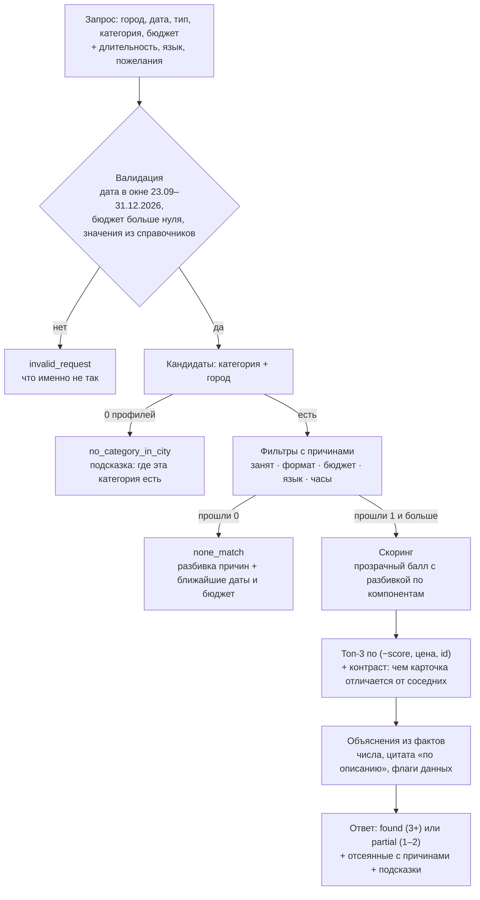

# Tandau — подбор event-подрядчиков с объяснениями

> Прототип для HackAlem AI, трек 06 «Креативные индустрии», кейс Firebird «Умный подбор подрядчиков».
>
> **Tandau** (таңдау — «выбор») по параметрам заказа выдаёт до трёх подрядчиков и честно объясняет, почему именно они. Если подобрать нельзя — говорит почему и что изменить.

| Коротко | |
| --- | --- |
| Запуск | `pip install -r requirements.txt` → `python run.py` → http://127.0.0.1:8000 |
| Нужно | Python 3.10+ и `pip`. Не нужно: `.env`, ключи API, Node.js, Docker, сервер БД |
| Доступ | Подбор работает **без регистрации**; демо-аккаунт `demo@tandau.kz` / `Demo2026!` |
| Проверка | Семь сценариев с ожидаемым результатом — раздел [«Как проверить решение»](#как-проверить-решение) |
| Развёрнутая версия | Нет — проект запускается локально за пару минут |

## Содержание

1. [Что делает проект и для кого](#что-делает-проект-и-для-кого)
2. [Что реализовано](#что-реализовано)
3. [Как это работает](#как-это-работает)
4. [Технологии](#технологии)
5. [Архитектура](#архитектура)
6. [Установка и запуск](#установка-и-запуск)
7. [Демо-доступ](#демо-доступ)
8. [Как проверить решение](#как-проверить-решение)
9. [API](#api)
10. [Данные](#данные)
11. [Формула скоринга](#формула-скоринга)
12. [Переменные окружения](#переменные-окружения)
13. [Тесты](#тесты)
14. [LLM-режим (необязательно)](#llm-режим-необязательно)
15. [Ограничения](#ограничения)
16. [Использованные компоненты, лицензии и AI-инструменты](#использованные-компоненты-лицензии-и-ai-инструменты)
17. [Языки интерфейса](#языки-интерфейса)
18. [Команда](#команда)
19. [English summary](#english-summary)

## Что делает проект и для кого

**Заказчику мероприятия.** Он уже выбрал город, дату и тип события и смотрит каталог агрегатора. Tandau сокращает каталог до трёх подрядчиков и к каждому пишет 1–2 предложения: чем именно он подходит этому заказу — цена и запас бюджета, формат, язык, часы, факт или цитата из описания.

**Площадке-агрегатору** (кейс Firebird). Выдача, которой можно доверять: занятые на дату не показываются, каждый отсев объяснён, пустой результат сопровождается подсказкой — какую дату, бюджет или город попробовать.

Главный принцип — **ценность в объяснении, а не в сортировке**. Объяснения собираются из проверяемых фактов профиля, без общих фраз вроде «отличный выбор для вашего мероприятия». Бронирование, заявки и уведомления подрядчикам — вне задачи: сервис только рекомендует.

## Что реализовано

- **Лендинг с кратким брифом**: пять условий события (город, дата, формат, категория, бюджет) переносятся в форму подбора `/app`.
- **Подбор до трёх подрядчиков** по городу, дате, типу мероприятия, категории и бюджету; опционально — длительность (ч), язык и свободные пожелания.
- **Пять различимых исходов** — у каждого свой баннер с цветом, иконкой и текстом:
  - `found` — подобрали;
  - `partial` — подобрали 1–2 и объяснили, почему не больше;
  - `no_category_in_city` — в этом городе такой категории нет (и где она есть);
  - `none_match` — кандидаты есть, но ни один не проходит (разбивка причин и подсказки);
  - `invalid_request` — запрос вне данных, например дата вне календаря.
- **Объяснение у каждой карточки** — 1–2 предложения из фактов: цена «от» и запас бюджета, форматы, языки, часы, стаж и объём работ из описания, цитата с пометкой «по описанию», контраст с соседними карточками («единственный из трёх, кто…»).
- **«Почему не больше»**: отсеянные кандидаты с именами и причинами (занят на дату, не берёт формат, дороже бюджета, не работает на языке, не работает так долго), воронка фильтров, подсказки — ближайшие даты, бюджет, другой город.
- **«Как посчитан балл»** под каждой карточкой: шесть факторов, значение, вес и вклад в итог.
- **Сравнение двух дат** (`/app/compare`): тот же запрос на две даты — кто вошёл, кто выпал и что дело в занятости.
- **Детерминизм**: тот же запрос — тот же порядок карточек и тот же JSON; ссылкой на выдачу можно поделиться.
- **Честность данных**: бейджи «синтетический профиль», «цена ориентировочная», «город уточняется», «цена «от» = бюджет».
- **Профиль подрядчика** (`/contractors/{id}`) с календарём занятости на 100 дней и счётчиками свободных дней.
- **Аккаунты**: регистрация, вход, выход, демо-аккаунт. Для вошедших — история запросов (без дублей подряд, до 50 записей, «Повторить» в один клик) и избранное (звезда на карточке, страница «Избранное»). Подбор никогда не требует входа.
- **Три языка интерфейса**: русский, казахский, английский.
- **JSON API** со Swagger-документацией (`/docs`).
- **Автотесты** (pytest): данные, настройки, бриф, страницы, авторизация, сценарии Definition of Done, качество объяснений, кабинет, гигиена релиза.
- **LLM-редактор формулировок** (необязательно, выключен по умолчанию): переписывает готовое объяснение, не меняя фактов.

## Как это работает



1. **Валидация.** Дата в окне календаря 23.09–31.12.2026, бюджет больше нуля, город, категория, формат и язык — из справочников (`/api/meta`). Иначе — `invalid_request` с объяснением, что не так.
2. **Кандидаты.** Профили нужной категории в нужном городе. Категория сравнивается по элементу списка: «Ведущий» ≠ «Ведущий церемонии». Кандидатов нет — `no_category_in_city` и подсказка, в каком городе категория есть.
3. **Фильтры с причинами.** Занят на дату · не берёт этот формат · цена «от» выше бюджета · не работает на выбранном языке · максимум часов меньше длительности. Проверяются все условия; у каждого отсеянного сохраняется полный список причин — из него строятся воронка, разбивка причин и подсказки.
4. **Скоринг.** Прозрачный балл для прошедших (см. [«Формула скоринга»](#формула-скоринга)); сортировка по `(−score, цена, id)` — без случайности.
5. **Топ-3 и контраст.** До трёх лучших карточек и число остальных подходящих (`more_count`); для каждой карточки ищется то, чем она отличается от двух других.
6. **Объяснения.** Из «атомов» — проверяемых фактов (бюджет, формат, язык, часы, стаж, цитата, флаг данных, контраст) — по шаблонам на языке интерфейса собираются 1–2 предложения. Общие фразы запрещены списком стоп-фраз и тестами.
7. **Ответ.** Статус, строка-итог, карточки, отсеянные с причинами, группы «почему не больше», воронка, подсказки и служебное поле `meta` (версия движка и объяснений, использован ли LLM, время ответа).

Формат объяснений на примере запроса S2 на 17 октября (фактический текст собирает движок, цитаты зависят от описаний):

> **Эмилия.** Берёт только свадьбы и тои — самый узкий профиль из трёх; 13 лет, 356 свадеб — по описанию. От 900 000 ₸, запас 100 000 ₸; до 10 ч — запас 2 ч к вашим 8 ч; цена проставлена при подготовке данных — уточните.
>
> **Кики.** Единственный из трёх, кто работает ещё и на английском; в описании прямо названы проводы невесты и обряд первых шагов. От 900 000 ₸, запас 100 000 ₸; до 10 ч — запас 2 ч к вашим 8 ч.

## Технологии

| Слой | Что используем | Версия |
| --- | --- | --- |
| Язык | Python | 3.10+ (проверено на 3.12) |
| Веб и API | FastAPI + Uvicorn | FastAPI >=0.110,<1.0 · Uvicorn >=0.27,<1.0 |
| Страницы | Jinja2 (серверный рендер) + ванильный JavaScript | Jinja2 >=3.1,<4.0 |
| Стили | Собственные CSS-файлы в `app/static/css/` на CSS-переменных: белые поверхности, чёрная типографика, синий акцент `#2B5FE3`; одна светлая тема (тёмной темы нет) | — |
| Шрифт | Geist, файл лежит в репозитории (`app/static/fonts/`), системный fallback | Geist 1.7.2 |
| Формы и сессии | python-multipart; подписанная cookie (Starlette `SessionMiddleware` + itsdangerous) | python-multipart >=0.0.9 · itsdangerous >=2.1,<3.0 |
| База данных | SQLite через стандартный `sqlite3`, файл `var/tandau.db` | входит в Python |
| Пароли и формы | `hashlib.scrypt` с солью; CSRF-токен в каждой POST-форме | входит в Python |
| Поиск по смыслу | Собственный TF-IDF по символьным n-граммам | без numpy и scikit-learn |
| Тесты | pytest + httpx (`TestClient`) | pytest >=8.0,<9.0 · httpx >=0.27,<0.28 |
| LLM (необязательно) | openai SDK | >=1.40,<2.0, файл `requirements-llm.txt` |

Обязательных зависимостей семь — все в `requirements.txt`. Node.js, сборка фронтенда, сервер БД и Docker не нужны.

## Архитектура

```text
tandau/
├── run.py                       # точка входа: python run.py → http://127.0.0.1:8000 (HOST, PORT из окружения)
├── requirements.txt             # 7 обязательных зависимостей
├── requirements-llm.txt         # необязательно: openai для LLM_MODE=on
├── .env.example                 # образец переменных окружения — всё необязательно
├── data/
│   ├── hackathon-dataset-anonymized.csv   # 66 профилей от организаторов, без изменений
│   └── enriched.json            # необязательно: факты из описаний, подготовленные офлайн
├── matcher/                     # движок подбора: чистый Python, без веб-зависимостей
│   ├── models.py                # Contractor, SearchRequest, Card, Rejection, SearchResponse
│   ├── data.py                  # загрузка CSV → Catalog: индексы, статистика, справочники
│   ├── validation.py            # проверка запроса → список ошибок для invalid_request
│   ├── filters.py               # жёсткие условия; каждая причина отсева — код busy/format/budget/language/duration
│   ├── scoring.py               # прозрачный балл и его разбивка (веса WEIGHTS — здесь)
│   ├── facts.py                 # факты из описаний: стаж, объём, масштаб, традиции
│   ├── evidence.py              # TF-IDF по символьным n-граммам, выбор лучшей цитаты
│   ├── explain.py               # атомы объяснения, контраст, сборка 1–2 предложений, стоп-фразы
│   ├── hints.py                 # подсказки: ближайшие даты, бюджет, другой город
│   ├── compare.py               # один запрос на две даты: вошли, выпали, остались
│   ├── llm.py                   # необязательный LLM-редактор с проверкой фактов
│   └── engine.py                # recommend(): весь пайплайн от запроса до ответа
├── app/                         # веб-слой FastAPI
│   ├── main.py                  # фабрика приложения: middleware, роутеры, статика, старт
│   ├── config.py                # настройки из окружения и .env, автогенерация SECRET_KEY
│   ├── db.py                    # SQLite: схема, пользователи, история, избранное, демо-пользователь
│   ├── security.py              # scrypt-хэш паролей, CSRF, безопасный next, ограничение попыток входа
│   ├── deps.py                  # текущий пользователь, защита страниц кабинета
│   ├── brief.py                 # нормализация и проверка пяти условий брифа с лендинга
│   ├── profiles.py              # профиль подрядчика: календарь, сводка занятости, JSON
│   ├── i18n.py                  # словари RU/KZ/EN, выбор языка
│   ├── web.py                   # render(): общий контекст и фильтры шаблонов
│   ├── routes/pages.py          # /, /app, /app/compare, /contractors/{id}, /lang/{code}, /designbook
│   ├── routes/auth.py           # /register, /login, /login/demo, /logout
│   ├── routes/account.py        # /account/history, /account/shortlist, /account/settings
│   ├── routes/api.py            # /healthz, /api/meta, /api/recommend, /api/compare, /api/contractors/{id}
│   ├── i18n/                    # ru.json, kk.json, en.json — тексты интерфейса
│   ├── templates/               # Jinja2-шаблоны страниц и общих блоков
│   └── static/                  # CSS, JS, шрифт Geist, SVG-иконки — без CDN
├── scripts/
│   ├── find_demo_queries.py     # печатает сильные демо-запросы по данным
│   ├── check_i18n.py            # полнота словарей ru/kk/en и переводов значений из CSV
│   └── enrich_llm.py            # необязательно: офлайн-обогащение описаний → data/enriched.json
├── tests/                       # pytest: данные, настройки, бриф, страницы, авторизация, DoD, объяснения, кабинет, релиз
├── docs/                        # мастер-план, справочник по данным, дизайнбук, задачи локализации
└── var/                         # создаётся при старте: tandau.db, secret_key (не в git)
```

- `matcher/` не зависит от веба: движок можно вызвать из скрипта или встроить в другой сервис; `app/` — только веб-слой поверх него.
- Каталог загружается из CSV один раз при старте, подбор идёт в памяти.
- SQLite хранит только пользователей, историю и избранное; подбор от базы не зависит.
- В основном режиме нет внешних сервисов; LLM — необязательный слой поверх готового объяснения.
- Справочник по данным и проверенные сценарии — [`docs/01_REFERENCE.md`](docs/01_REFERENCE.md), общий план — [`docs/00_MASTER_PLAN.md`](docs/00_MASTER_PLAN.md), дизайн-система — [`docs/TANDAU_DESIGNBOOK.md`](docs/TANDAU_DESIGNBOOK.md).

## Установка и запуск

**Требования:** Python 3.10 или новее, `pip`, `git` (или ZIP-архив репозитория). Интернет нужен только для `pip install`; сам сервис работает офлайн — без CDN, внешних шрифтов и API. Единственное исключение — страница Swagger UI `/docs`: FastAPI по умолчанию загружает её JS и CSS с CDN.

### macOS / Linux

```bash
git clone https://github.com/BAITC-Hacks/hack-ce6ddbc4-apex.git tandau
cd tandau
python3 -m venv .venv
source .venv/bin/activate
pip install -r requirements.txt
python run.py
```

### Windows (PowerShell)

```powershell
git clone https://github.com/BAITC-Hacks/hack-ce6ddbc4-apex.git tandau
cd tandau
python -m venv .venv
.venv\Scripts\Activate.ps1
pip install -r requirements.txt
python run.py
```

- Команда `python` не найдена — используйте `py -3 -m venv .venv`.
- PowerShell запрещает `Activate.ps1` — выполните в этом же окне `Set-ExecutionPolicy -Scope Process -ExecutionPolicy Bypass` и повторите активацию, либо в `cmd` выполните `.venv\Scripts\activate.bat`.
- Без активации тоже можно: `.venv\Scripts\python.exe -m pip install -r requirements.txt`, затем `.venv\Scripts\python.exe run.py`.

### Без git

GitHub → **Code → Download ZIP**, распакуйте в папку, путь к которой без кириллицы и пробелов (например, `C:\work\tandau`), откройте в ней терминал и выполните команды, начиная с создания `.venv`.

### Что вы увидите

```text
INFO:     Started server process [...]
INFO:     Waiting for application startup.
INFO:     Application startup complete.
INFO:     Uvicorn running on http://127.0.0.1:8000 (Press CTRL+C to quit)
```

| Адрес | Что там |
| --- | --- |
| http://127.0.0.1:8000 | Лендинг |
| http://127.0.0.1:8000/app | Подбор — без регистрации |
| http://127.0.0.1:8000/docs | API (Swagger) |
| http://127.0.0.1:8000/healthz | `{"status":"ok","profiles":66}` |

При первом запуске в папке `var/` создаются база SQLite `tandau.db` (с демо-аккаунтом) и ключ подписи сессий `secret_key`. Остановить сервер — `Ctrl+C`. Папку `var/` можно удалить в любой момент: при следующем запуске всё создастся заново.

### Если порт 8000 занят

```bash
PORT=8001 python run.py              # macOS / Linux
```

```powershell
$env:PORT = "8001"; python run.py    # Windows PowerShell
```

Затем откройте http://127.0.0.1:8001 и замените порт в ссылках раздела «Как проверить решение».

### Вариант: Docker (необязательно)

```bash
docker compose up --build
```

Затем http://127.0.0.1:8000. Основной и проверенный способ — без Docker (выше).

## Демо-доступ

Проверка не требует личных аккаунтов участников команды и ключей внешних сервисов.

| Режим | Как войти | Что доступно |
| --- | --- | --- |
| Гость | Ничего не нужно — откройте `/app` | Подбор, сравнение дат, профили подрядчиков, весь JSON API |
| Демо-аккаунт | `/login` → кнопка «Войти как демо» (без ввода пароля) или email `demo@tandau.kz`, пароль `Demo2026!` | Всё то же + история запросов и избранное |
| Свой аккаунт | `/register`: имя, email и пароль от 8 символов с буквой и цифрой | То же, что у демо-аккаунта |

Демо-аккаунт создаётся автоматически при первом запуске; пароль хранится только как scrypt-хэш в `var/tandau.db`. Аккаунт общий: историю и избранное в нём видят все, кто в него входит. После 5 неудачных попыток входа для одного email вход по паролю на 5 минут приостанавливается; кнопку «Войти как демо» это не блокирует.

## Как проверить решение

### За 5 минут

1. `python run.py`, затем http://127.0.0.1:8000/healthz → `{"status":"ok","profiles":66}`.
2. **S1** — плотная категория: ранжирование реально работает.
3. **S2** — один запрос на две даты: выдача меняется из-за занятости.
4. **S4** и **S5** — «в городе нет такой категории» и «кандидаты есть, но никто не проходит»: объяснено словами, с подсказками.
5. Обновите страницу S1 или откройте ссылку ещё раз — порядок карточек тот же.
6. `python -m pytest -q` — все тесты зелёные.

Ссылки ниже работают, когда сервер запущен на порту 8000. Все параметры видны в форме подбора, их можно менять. Ожидаемые результаты посчитаны по полному файлу данных.

### S1 · Плотная категория — ранжирование работает

**Алматы · 2026-10-10 · корпоратив · Ведущий · 1 500 000 ₸ · 6 ч** — [открыть S1](http://127.0.0.1:8000/app?city=Алматы&date=2026-10-10&event_type=корпоратив&category=Ведущий&budget=1500000&duration=6)

Ожидается баннер «Подобрали» (`found`). Условиям соответствуют 5 ведущих — Куррапика, Аня Форджер, Хаул, Сон Гоку, Джинбей; показаны три лучших и «ещё 2». Воронка: 15 ведущих → 10 в Алматы → 6 свободны 10.10 → 6 берут корпоратив → 5 в бюджете → 5 по часам. В отсеве с причинами: Буллма, Мицури Канроджи, Кики — заняты; Эмилия — занята и не берёт корпоративы; Софи Хаттер — дороже бюджета.

### S2 · Один запрос, две даты — причина в занятости

**Алматы · свадьба · Ведущий · 1 000 000 ₸ · казахский · 8 ч**

- [10 октября](http://127.0.0.1:8000/app?city=Алматы&date=2026-10-10&event_type=свадьба&category=Ведущий&budget=1000000&language=казахский&duration=8) → `partial`: Хаул, Сон Гоку. Отсев: Эмилия и Кики заняты 10 октября; Мицури Канроджи занят и не ведёт на казахском; Софи Хаттер дороже бюджета; Куррапика, Джинбей, Аня Форджер, Буллма не берут свадьбы. Подсказка: 3 ведущих подходят 9 октября (Эмилия, Кики, Хаул) и 11 октября (Эмилия, Хаул, Сон Гоку).
- [17 октября](http://127.0.0.1:8000/app?city=Алматы&date=2026-10-17&event_type=свадьба&category=Ведущий&budget=1000000&language=казахский&duration=8) → `found`: Эмилия (бейдж «цена ориентировочная» — цена проставлена при подготовке данных), Кики, Хаул. Отсев: Сон Гоку занят 17 октября.
- [Сравнить две даты](http://127.0.0.1:8000/app/compare?city=Алматы&event_type=свадьба&category=Ведущий&budget=1000000&language=казахский&duration=8&date_a=2026-10-10&date_b=2026-10-17) → вошли Эмилия и Кики (были заняты 10.10), выпал Сон Гоку (занят 17.10), остался Хаул.

### S3 · Редкая категория

**Алматы · 2026-10-10 · той · Ведущий церемонии · 300 000 ₸ · казахский** — [открыть S3](http://127.0.0.1:8000/app?city=Алматы&date=2026-10-10&event_type=той&category=Ведущий%20церемонии&budget=300000&language=казахский)

Ожидается `partial`: Спайк Спигел (200 000 ₸, свадьба и той, казахский и русский, до 3 ч). Второй профиль категории в Алматы — Субару Нацуки (синтетический) — занят 10.10 и не ведёт тои. Ближайших дат с двумя вариантами нет: вторая карточка возможна только для свадьбы.

Синтетический профиль в выдаче: **Алматы · 2026-11-14 · свадьба · Флорист · 300 000 ₸** — [открыть](http://127.0.0.1:8000/app?city=Алматы&date=2026-11-14&event_type=свадьба&category=Флорист&budget=300000) → `partial`: единственный подходящий — Тихиро Огино с бейджем «синтетический профиль»; реальный Тони Тони Чоппер занят 14.11.

### S4 · В этом городе такой категории нет

**Астана · 2026-11-14 · свадьба · Декоратор · 2 500 000 ₸** — [открыть S4](http://127.0.0.1:8000/app?city=Астана&date=2026-11-14&event_type=свадьба&category=Декоратор&budget=2500000)

Ожидается баннер «В этом городе такой категории нет» (`no_category_in_city`) и подсказка: в Алматы — 3 профиля в категории «Декоратор», из них 2 синтетических.

### S5 · Кандидаты есть, но никто не проходит

**Алматы · 2026-12-26 · той · Ведущий · 700 000 ₸** — [открыть S5](http://127.0.0.1:8000/app?city=Алматы&date=2026-12-26&event_type=той&category=Ведущий&budget=700000)

Ожидается баннер «Кандидаты есть, но ни один не проходит по условиям» (`none_match`). Из 10 ведущих Алматы 9 заняты 26.12; свободен только Мицури Канроджи (650 000 ₸), но он не ведёт тои. Тои ведут только Эмилия и Кики (от 900 000 ₸), Сон Гоку (1 000 000 ₸) и Софи Хаттер (2 000 000 ₸) — все дороже 700 000 ₸. Подсказка: «С бюджетом от 900 000 ₸ 27 декабря свободны Эмилия и Кики». В пределах ±14 дней при 700 000 ₸ вариантов нет — это тоже сказано прямо.

### S6 · Площадка: «подобрать зал на 14 ноября»

**Алматы · 2026-11-14 · свадьба · Банкетный зал · 3 500 000 ₸** — [открыть S6](http://127.0.0.1:8000/app?city=Алматы&date=2026-11-14&event_type=свадьба&category=Банкетный%20зал&budget=3500000)

Ожидается `partial`: Иноскэ Хашибира (2 500 000 ₸; цена и город проставлены при подготовке данных — бейджи) и Гохан (3 200 000 ₸, синтетический профиль). Отсев: Шинобу Кочо, Хината Хьюга, Дарквнесс — заняты; Асуна Юки — занята и дороже; Сосукэ — занят, не берёт свадьбы и дороже.

### S7 · Некорректный запрос

Дата вне календаря, например **Алматы · 2027-01-15 · корпоратив · Ведущий · 1 500 000 ₸** — [открыть S7](http://127.0.0.1:8000/app?city=Алматы&date=2027-01-15&event_type=корпоратив&category=Ведущий&budget=1500000&duration=6)

Ожидается серый баннер `invalid_request`: «Календарь есть только на 23.09–31.12.2026».

### Кабинет и профиль подрядчика (2 минуты)

1. Без входа откройте [профиль Эмилии](http://127.0.0.1:8000/contractors/HK-42352): 10 октября занято, 17 октября свободно. Поэтому в сценарии S2 Эмилия выпадает 10.10 и входит 17.10.
2. Войдите демо-аккаунтом (`/login` → «Войти как демо» или `demo@tandau.kz` / `Demo2026!`) и выполните S2.
3. Нажмите звезду у Эмилии — она появится в «Кабинет → Избранное».
4. «Кабинет → История» → «Повторить»: та же выдача в том же порядке.

### Детерминизм

- **В браузере:** откройте ссылку S1 дважды или обновите страницу — тот же порядок карточек и те же тексты.
- **Через API:** два одинаковых запроса дают одинаковый JSON; отличается только `meta.latency_ms` — время ответа.
- **Тестом:** `python -m pytest -q -k determinism`.

```bash
# macOS / Linux: два одинаковых запроса, сравнение без поля meta
for i in 1 2; do
  curl -s -X POST http://127.0.0.1:8000/api/recommend -H "Content-Type: application/json" \
    -d '{"city":"Алматы","date":"2026-10-10","event_type":"корпоратив","category":"Ведущий","budget_kzt":1500000,"duration_h":6}' \
  | python -c "import json,sys; d=json.load(sys.stdin); d.pop('meta',None); print(json.dumps(d,sort_keys=True,ensure_ascii=False))" > /tmp/tandau_run$i.json
done
diff /tmp/tandau_run1.json /tmp/tandau_run2.json && echo identical
```

### Проверка через API

```bash
curl -s -X POST http://127.0.0.1:8000/api/recommend \
  -H "Content-Type: application/json" \
  -d '{"city":"Алматы","date":"2026-10-10","event_type":"корпоратив","category":"Ведущий","budget_kzt":1500000,"duration_h":6}' \
  | python -m json.tool --no-ensure-ascii
```

Ожидается: `"status": "found"`; в `cards` — три карточки из пяти прошедших (`HK-88430`, `HK-29829`, `HK-77838`, `HK-27222`, `HK-75012`), у каждой `explanation`, `badges`, `score` и `score_breakdown`; `"more_count": 2`; в `rejected` — пять отсеянных с кодами причин (`busy`, `format`, `budget`).

Сравнение двух дат (S2):

```bash
curl -s -X POST http://127.0.0.1:8000/api/compare \
  -H "Content-Type: application/json" \
  -d '{"request":{"city":"Алматы","event_type":"свадьба","category":"Ведущий","budget_kzt":1000000,"language":"казахский","duration_h":8},"date_a":"2026-10-10","date_b":"2026-10-17"}' \
  | python -m json.tool --no-ensure-ascii
```

Ожидается: в `a` — `partial` с `HK-77838` и `HK-27222`; в `b` — `found` с `HK-42352`, `HK-35215`, `HK-77838`; в `diff` — `entered`: `HK-42352` и `HK-35215` (причина `busy`: были заняты 10.10), `left`: `HK-27222` (причина `busy`: занят 17.10), `stayed`: `HK-77838`.

**Windows.** Проще всего — http://127.0.0.1:8000/docs → `POST /api/recommend` → **Try it out** → вставить JSON → **Execute**. Или в PowerShell:

```powershell
$body = '{"city":"Алматы","date":"2026-10-10","event_type":"корпоратив","category":"Ведущий","budget_kzt":1500000,"duration_h":6}'
$r = Invoke-RestMethod -Method Post -Uri http://127.0.0.1:8000/api/recommend -ContentType "application/json; charset=utf-8" -Body ([Text.Encoding]::UTF8.GetBytes($body))
$r.status; $r.cards.id; $r.more_count
```

В Windows PowerShell 5.1 кириллица в выводе может отображаться неверно — это особенность консоли; статус и id латиницей читаются.

## API

Интерактивная документация — http://127.0.0.1:8000/docs (Swagger UI, запросы можно отправлять из браузера; сама страница загружает JS и CSS с CDN). Схема — http://127.0.0.1:8000/openapi.json, работает офлайн. Для JSON API не нужны вход и CSRF-токен.

| Метод | Путь | Что делает |
| --- | --- | --- |
| GET | `/healthz` | Проверка живости: `{"status":"ok","profiles":66}` |
| GET | `/api/meta` | Справочники для формы: города, категории с количеством по городам, форматы, языки, окно дат |
| POST | `/api/recommend` | Подбор: `SearchRequest` → `SearchResponse` |
| POST | `/api/compare` | Один запрос на две даты: `{request, date_a, date_b}` → `{date_a, date_b, a, b, diff}`; `422`, если даты совпадают |
| GET | `/api/contractors/{id}` | Профиль подрядчика и его занятость; неизвестный id → `404` |

Коды ответа `/api/recommend`: `200` — запрос прочитан, в том числе если он невыполним: `status: invalid_request` с перечнем ошибок в `summary` и `hints` (дата вне окна, неизвестный город, бюджет не больше нуля); `422` — запрос нельзя прочитать (битый JSON, нет обязательного поля, неверный тип).

`SearchRequest` — значения на русском, как в данных:

| Поле | Тип | Обязательно | Значения |
| --- | --- | --- | --- |
| `city` | строка | да | Алматы, Астана, Зарубежье |
| `date` | строка `YYYY-MM-DD` | да | 2026-09-23 … 2026-12-31 |
| `event_type` | строка | да | свадьба, той, корпоратив, конференция, юбилей, день рождения |
| `category` | строка | да | одна из 17 категорий (`/api/meta`) |
| `budget_kzt` | целое | да | больше нуля, ₸ |
| `duration_h` | целое | нет | длительность, 1–24 ч |
| `language` | строка | нет | русский, казахский, английский |
| `wishes` | строка | нет | свободный текст до 500 символов: влияет на смысловую релевантность и выбор цитаты |
| `lang` | строка | нет | язык текстов объяснений: `ru` (по умолчанию), `kk`, `en` |

`SearchResponse`:

| Поле | Что внутри |
| --- | --- |
| `status` | `found` · `partial` · `no_category_in_city` · `none_match` · `invalid_request` |
| `summary` | Одна строка для баннера |
| `cards` | До 3 карточек: `id`, `name`, `category`, `city`, `price_from_kzt`, `badges`, `explanation`, `atoms`, `score`, `score_breakdown` |
| `more_count` | Сколько ещё подходят, но ниже в рейтинге |
| `rejected` | Отсеянные: `id`, `name`, `reasons` (`busy`, `format`, `budget`, `language`, `duration`), `details` |
| `reason_counts` | Сколько раз встречается каждая причина отсева |
| `funnel` | Воронка фильтров: шаг и сколько кандидатов осталось |
| `hints` | Подсказки: ближайшие даты, бюджет, другой город, что исправить в запросе |
| `meta` | `engine` (версия движка), `explain` (версия объяснений), `llm_used`, `latency_ms` |
| `why_not` | «Почему не больше»: группы по первичной причине — `reason`, `ids`, готовый `text` |

Страницы: `/` — лендинг · `/app` — подбор (параметры запроса — в адресной строке: `city`, `date`, `event_type`, `category`, `budget`, `duration`, `language`; ссылкой можно поделиться) · `/app/compare` — две даты (те же параметры + `date_a`, `date_b`) · `/contractors/{id}` — профиль · `/register`, `/login`, `/login/demo` (кнопка «Войти как демо»), `/logout` (только POST) · `/account/history` (+ `POST /account/history/clear`), `/account/shortlist` (+ `POST /account/shortlist/{id}` — звезда), `/account/settings` — для вошедших · `/lang/{ru|kk|en}` — язык · `/designbook`, `/designbook/landing` — служебный дизайнбук интерфейса. HTML-страницы входа и кабинета скрыты из Swagger: формы с CSRF оттуда не отправить.

## Данные

Файл `data/hackathon-dataset-anonymized.csv` — анонимизированный каталог event-подрядчиков от организаторов (кейс Firebird): **66 профилей, 13 колонок, UTF-8**. Загружается один раз при старте; в репозитории лежит без изменений, своих профилей мы не добавляли.

| Поле | Пример | Как читаем |
| --- | --- | --- |
| `id` | `HK-39372` | Уникальный идентификатор |
| `anon_name` | `Тони Тони Чоппер` | Анонимизированное имя |
| `categories` | `Банкетный зал\|Загородная площадка\|Ресторан` | Список через `\|`; сравнение по элементу: «Ведущий» ≠ «Ведущий церемонии» |
| `city` | `Алматы` | Точное совпадение: Алматы, Астана, Зарубежье |
| `price_from_kzt` | `200000` | Цена «от» за мероприятие, ₸ |
| `event_formats` | `свадьба\|корпоратив` | Свадьба, той, корпоратив, конференция, юбилей, день рождения |
| `languages` | `русский\|английский` | Русский, казахский, английский |
| `max_hours` | `6` или пусто | Пусто — работа не привязана к присутствию (флорист, декоратор, сувениры) |
| `busy_dates` | `2026-09-25\|2026-09-30` | Занятые даты в окне 23.09–31.12.2026 |
| `description` | свободный текст | Источник фактов и цитат; жёстких фильтров по описанию нет |
| `synthetic`, `price_imputed`, `city_imputed` | `True` / `False` | Флаги качества данных |

**Каталог в цифрах:** Алматы 50 · Астана 15 · Зарубежье 1. 17 категорий: плотные — Ведущий 15, Фотограф 12, Банкетный зал 8; редкие, по 3 профиля, — Флорист, Декоратор, Подарки и сувениры, Ведущий церемонии, Фото и видеобудки, Отель, Инструменталист. Занятость — в среднем 50.6 дня из 100: сентябрь–ноябрь 30–50 %, декабрь 70–80 %.

**Календарь в профиле подрядчика** строится из `busy_dates`, окно 23.09–31.12.2026 (100 дней). Счётчики («ближайшие 30 дней», по месяцам) считаются от 23.09, а не от текущей даты — так ответы детерминированы.

**Флаги и как они показаны в интерфейсе:**

| Флаг | Сколько | Что значит | Как видно в интерфейсе |
| --- | --- | --- | --- |
| `synthetic` | 13 (HK-90001…HK-90013) | Синтетический профиль из датасета организаторов, не реальный подрядчик | Бейдж «синтетический профиль» на карточке и в профиле; в подсказках синтетические считаются отдельно («из них 2 синтетических») |
| `price_imputed` | 18 | Цена «от» проставлена при подготовке данных | Бейдж «цена ориентировочная»; в объяснении — просьба уточнить цену |
| `city_imputed` | 8 (все площадки, фотобудка HK-35846, ансамбль HK-19103) | Город проставлен при подготовке данных | Бейдж «город уточняется» |
| вычисляется | — | Цена «от» равна бюджету | Бейдж «цена «от» = бюджет»: итог может оказаться выше |

Если в репозитории есть `data/enriched.json` — это заранее извлечённые из описаний факты (скрипт `scripts/enrich_llm.py`, запускался офлайн; сохраняются только поля, подтверждённые подстрокой описания). Без него факты извлекаются правилами в `matcher/facts.py`.

**Внешние сервисы:** для работы не нужны. LLM опционален и по умолчанию выключен, ключ не нужен. Необязательно — OpenAI API или совместимый эндпоинт для LLM-режима.

## Формула скоринга

Жёсткие условия — дата, формат, бюджет, язык, часы — в балл не входят: они отсекают. Балл считается только для прошедших и отвечает на вопрос «кто из подходящих подходит лучше»:

```text
score = 0.30·budget_fit + 0.25·relevance + 0.20·focus + 0.15·experience + 0.10·extras − 0.05·flags
```

Каждый компонент — от 0 до 1. Положительные веса в сумме дают 1.00, а штраф `flags` вычитает не больше 0.05, поэтому итоговый балл лежит в диапазоне от −0.05 до 1.00.

| Компонент | Ключ в `score_breakdown` | Как считается | Вес |
| --- | --- | --- | --- |
| Запас бюджета | `budget_fit` | 1 − цена «от» / бюджет, обрезано до [0, 1]: доля бюджета, которая остаётся. 900 000 ₸ при бюджете 1 000 000 ₸ → 0.10; цена «от» = бюджет → 0 | 0.30 |
| Смысловая близость | `relevance` | Косинус TF-IDF (символьные n-граммы 3–5) между описанием и запросом (синонимы формата, традиции, категория, язык, пожелания `wishes`), делённый на максимум среди прошедших: 1.0 у самого близкого | 0.25 |
| Специализация | `focus` | Доля форматов профиля из «семейства» запроса: {свадьба, той}, {корпоратив, конференция}, {юбилей, день рождения}. Берёт только свадьбы и тои при запросе свадьбы → 1.0 | 0.20 |
| Опыт | `experience` | ½·min(стаж / 15, 1) + ½·min(ln(1 + число мероприятий) / ln 1001, 1) — стаж и объём работ из описания | 0.15 |
| Дополнительно | `extras` | Среднее трёх: дополнительные языки min(n, 2) / 2; запас часов min(max(запас, 0), 4) / 4; 1, если в описании названы традиции или деловые форматы запроса, у площадки 2+ типа (например, зал и отель) или масштаб от 500 гостей | 0.10 |
| Флаги данных (штраф) | `flags` | min(1, 0.6·синтетический + 0.2·цена проставлена + 0.2·город проставлен) | −0.05 |

- Список компонентов и веса заданы в одном месте — `WEIGHTS` в `matcher/scoring.py`.
- Разбивка каждого балла — поле `score_breakdown` карточки: шесть значений компонентов до весов. В интерфейсе под карточкой раскрывается «Как посчитан балл»: значение, вес и вклад каждого фактора.
- Компоненты и балл округляются до 4 знаков, поэтому вклады в раскрывашке сходятся с итогом. Порядок — по `(−score, цена «от», id)`: при равном балле выше тот, кто дешевле, затем по id. Случайности нет.
- Веса подобраны вручную и не обучались: обучение на 66 записях — вне задачи.

## Переменные окружения

Все переменные **необязательны**: без `.env` приложение запускается с безопасными значениями по умолчанию.

| Переменная | По умолчанию | Назначение |
| --- | --- | --- |
| `HOST` | `127.0.0.1` | Адрес сервера (в Docker — `0.0.0.0`) |
| `PORT` | `8000` | Порт сервера |
| `SECRET_KEY` | пусто → генерируется и сохраняется в `var/secret_key` | Подпись cookie сессии |
| `DATABASE_PATH` | `var/tandau.db` | Файл SQLite: пользователи, история, избранное; относительный путь считается от корня проекта |
| `LLM_MODE` | `off` | `off` или `on` — необязательный LLM-редактор |
| `OPENAI_API_KEY` | пусто | Ключ API — нужен только при `LLM_MODE=on` |
| `OPENAI_MODEL` | пусто | Имя модели — только при `LLM_MODE=on` |
| `OPENAI_BASE_URL` | пусто — OpenAI API | OpenAI-совместимый эндпоинт |

Как задать: `cp .env.example .env` (Windows: `Copy-Item .env.example .env`) и отредактировать `.env`. Переменные окружения процесса важнее значений из файла. `.env` в `.gitignore` и в репозиторий не попадает. При смене `SECRET_KEY` или удалении `var/secret_key` ранее выданные сессии становятся недействительными.

## Тесты

```bash
python -m pytest -q
```

Ожидается строка `N passed` без `failed` и `error`, несколько секунд.

| Файл | Что проверяет |
| --- | --- |
| `tests/test_data.py` | Загрузка CSV: 66 профилей, флаги 13 / 18 / 8, 17 категорий, пустой `max_hours`, даты в окне, категории по элементу списка, отказ на битых данных |
| `tests/test_config.py` | Чтение `.env`, приоритет окружения, сохранение и приватность `SECRET_KEY`, запуск из другой папки |
| `tests/test_i18n.py` | Перевод с запасным русским, подстановки, порядок выбора языка |
| `tests/test_brief.py` | Бриф лендинга: нормализация пяти условий, адрес `/app`, ошибки ввода |
| `tests/test_pages.py` | Лендинг на разных языках, переключатель языка и безопасные редиректы, `/healthz`, `/api/meta`, `/docs`, `/app` |
| `tests/test_auth.py` | Регистрация, вход, выход, демо-аккаунт, CSRF, ограничение попыток, защищённые страницы |
| `tests/test_engine_dod.py` | Движок: пять статусов, причины отсева, сценарии, детерминизм |
| `tests/test_explanations.py` | Факты и цитаты из описаний, объяснения без стоп-фраз, различимые без имён, с числами или цитатой; подсказки и сравнение дат |
| `tests/test_account.py` | История запросов, избранное, профиль подрядчика и его API |
| `tests/test_release.py` | Сценарии S1–S7 через HTTP API, сравнение дат, бейджи, детерминизм, время ответа, полнота README, отсутствие ключей, работа без LLM и секретов |

Проверка словарей интерфейса: `python scripts/check_i18n.py`.

## LLM-режим (необязательно)

По умолчанию выключен (`LLM_MODE=off`), и всё, что описано в «Как проверить решение», работает без него: без ключей, без интернета и без личных аккаунтов (п. 5.6.6 Положения).

**Что делает.** Берёт готовое объяснение, собранное движком из фактов, и переписывает его более естественным языком. Выбор подрядчиков, порядок карточек, статусы и причины отсева от LLM не зависят. Переписанный текст проверяется: числа и факты должны совпасть с исходными, стоп-фразы запрещены. Если проверка не пройдена, ключа нет или сервис недоступен — остаётся шаблонный текст. Был ли использован LLM, видно в `meta.llm_used`.

**Как включить:**

```bash
pip install -r requirements-llm.txt
cp .env.example .env                 # Windows: Copy-Item .env.example .env
```

В `.env` впишите значения после знака `=` (файл в `.gitignore`):

```dotenv
LLM_MODE=on
OPENAI_API_KEY=
OPENAI_MODEL=
# пусто — OpenAI API; можно указать OpenAI-совместимый эндпоинт
OPENAI_BASE_URL=
```

Затем перезапустите `python run.py`.

## Ограничения

- **Каталог — 66 анонимизированных профилей**, календарь занятости только на 23.09–31.12.2026 (100 дней). Запросы на другие даты честно отклоняются (`invalid_request`).
- **13 профилей синтетические** (HK-90001…HK-90013) — они пришли в датасете организаторов, своих мы не добавляли. В Астане единственные банкетный зал, отель, флорист, сувениры, ведущий церемонии и фотобудка — синтетические. Все помечены бейджем.
- **Часть значений проставлена при подготовке данных**: цена у 18 профилей, город у 8. Они помечены бейджами, в объяснении предлагаем уточнить.
- **Цена в данных — «от»**: итоговая стоимость может быть выше, бюджет сравнивается с ценой «от». Если они равны — предупреждаем бейджем.
- **Факты из описаний извлекаются правилами** (числа, в том числе словами, стаж, объёмы) и могут пропускать нестандартные формулировки. Маркетинговые и личные детали в объяснения намеренно не попадают.
- **Профили с одинаковыми полями** (например, ансамбли с близкой ценой, одинаковыми языками и часами) различаются в объяснениях только описанием — цитатой и фактами из него.
- **Цитаты из описаний — на русском**, как в оригинале, даже в казахском и английском интерфейсе; помечены «по описанию».
- **Длительность не проверяется**, если у профиля нет ограничения по часам (флористы, декораторы, сувениры — 9 профилей).
- **Веса скоринга подобраны вручную** и не обучались на поведении пользователей — таких данных нет.
- **Прототип для одного процесса**: SQLite и подписанные cookie-сессии, без HTTPS. Бронирования, заявок и уведомлений подрядчикам нет — это вне задачи.
- **История и избранное** хранятся в локальной SQLite (`var/`, не в репозитории); на чистом клоне база пустая. Демо-аккаунт общий для всех, кто в него входит. Время в истории — UTC+5 (Астана).
- **Лимита регистраций с одного IP нет**: массовую регистрацию замедляет только scrypt. Вход по паролю ограничен 5 неудачами на email за 5 минут.
- **Swagger UI (`/docs`) загружает JS и CSS с CDN** (поведение FastAPI по умолчанию) и без интернета не откроется; JSON API и `/openapi.json` работают офлайн.
- **Развёрнутой версии нет** — запуск локально по инструкции выше.
- **LLM-режим** (если включён) зависит от внешнего API и ключа; по умолчанию выключен.
- **Казахские термины**, которых нет в официальной KZ-версии ТЗ (например, «Лайв-бэнд», «Загородная площадка»), переведены командой.

## Использованные компоненты, лицензии и AI-инструменты

Раскрытие по п. 5.4.4 Положения.

| Компонент | Версия (`requirements`) | Лицензия | Зачем |
| --- | --- | --- | --- |
| FastAPI | >=0.110,<1.0 | MIT | Веб-фреймворк, JSON API, Swagger `/docs` |
| Starlette (зависимость FastAPI) | ставится с FastAPI | BSD-3-Clause | Маршрутизация, `SessionMiddleware`, статика |
| Pydantic (зависимость FastAPI) | ставится с FastAPI | MIT | Валидация JSON API |
| Uvicorn | >=0.27,<1.0 | BSD-3-Clause | ASGI-сервер (`python run.py`) |
| Jinja2 | >=3.1,<4.0 | BSD-3-Clause | Серверные шаблоны страниц |
| itsdangerous | >=2.1,<3.0 | BSD-3-Clause | Подпись cookie сессии |
| python-multipart | >=0.0.9 | Apache-2.0 | Разбор HTML-форм |
| pytest | >=8.0,<9.0 | MIT | Автотесты |
| httpx | >=0.27,<0.28 | BSD-3-Clause | Тестовый HTTP-клиент (`TestClient`) |
| openai (необязательно) | >=1.40,<2.0 | Apache-2.0 | Только для `LLM_MODE=on` |
| Шрифт Geist (`app/static/fonts/`) | 1.7.2, из npm-пакета `geist`, без изменений | SIL Open Font License 1.1 (`Geist-OFL.txt`) | Основной шрифт интерфейса; лежит в репозитории, npm-зависимостей нет |
| Стандартная библиотека Python: `sqlite3`, `hashlib`, `csv`, `json` | 3.10+ | PSF | База данных, хэш паролей, чтение данных |

**Данные:** `data/hackathon-dataset-anonymized.csv` — анонимизированный каталог 66 event-подрядчиков, предоставлен организаторами хакатона (кейс Firebird); используется без изменений.

**Модели:** в основном режиме никакие ML-модели и эмбеддинги не используются — TF-IDF по символьным n-граммам реализован в `matcher/evidence.py`. В необязательном LLM-режиме — модель из `OPENAI_MODEL` через OpenAI API или совместимый эндпоинт.

**Внешние ресурсы интерфейса:** CSS, JavaScript, SVG-иконки и шрифт Geist лежат в репозитории; CDN и внешние шрифты страницы сервиса не подключают. Исключение — стандартная страница Swagger UI `/docs`: её JS и CSS FastAPI загружает с CDN.

**AI-инструменты разработки:** в разработке использовались два AI-агента для программирования — **Codex** (OpenAI) и **Claude Code** (Anthropic); использование AI-агента — условие организаторов. С их помощью по поэтапным спецификациям генерировались код, тесты, переводы и документация, включая этот README. Каждый шаг команда проверяла автотестами и ручным прогоном сценариев S1–S7. Сам сервис во время работы не требует никакой AI-модели: по умолчанию подбор и объяснения полностью детерминированы, LLM подключается только при явном `LLM_MODE=on`.

## Языки интерфейса

Русский (`ru`, по умолчанию), казахский (`kk`) и английский (`en`). Плоские JSON-словари находятся в `app/i18n/`. Язык выбирается по `?lang=`, затем cookie `lang`, затем предпочтению пользователя и наконец `ru`. Переключатель сохраняет cookie на год.

Отсутствующий перевод берётся из русского словаря; если ключ отсутствует и там, показывается сам ключ. Значения каталога внутри модели и API остаются на русском, как в CSV; для интерфейса используются ключи `data.*`. Переводы основаны на глоссарии из `docs/01_REFERENCE.md`; участник 2 может дополнительно проверить казахскую редактуру.

## Команда

**apex** — HackAlem AI, трек 06 «Креативные индустрии». Репозиторий: https://github.com/BAITC-Hacks/hack-ce6ddbc4-apex

| Участник | Роль | GitHub |
| --- | --- | --- |
| Kassymzhomart Shubay | Главный разработчик: движок подбора, веб-приложение, тесты, README | [k4ssymzhomart](https://github.com/k4ssymzhomart) |
| Yasmin | Локализация RU/KZ/EN, тексты интерфейса, логотип, скриншоты, проверка воспроизводимости | [yassmn126](https://github.com/yassmn126) |

## English summary

**Tandau** is a prototype for HackAlem AI (track 06 Creative Industries, Firebird case "Smart contractor matching"). Given a city, date, event type, contractor category and budget (optionally duration and language), it returns up to three event contractors from a catalog of 66 anonymised profiles. Each card comes with a 1–2 sentence explanation built from verifiable facts: price vs budget, formats, languages, hours, experience and a quote from the profile. When fewer than three match, Tandau says why (booked on the date, over budget, format not offered, no such category in the city) and suggests nearby dates, a budget or another city.

- **Run:** Python 3.10+ → `python -m venv .venv` → activate → `pip install -r requirements.txt` → `python run.py` → http://127.0.0.1:8000
- **Access:** no sign-up needed; demo account `demo@tandau.kz` / `Demo2026!`; no API keys required — the LLM mode is optional and off by default.
- **Verify:** scenarios S1–S7 above (S1 `found`, S2 two dates, S4 `no_category_in_city`, S5 `none_match`, S7 `invalid_request`), the JSON API at `/docs`, tests with `python -m pytest -q`.
- **Deterministic:** the same request always returns the same order and the same JSON (except `meta.latency_ms`).
- **Stack:** FastAPI, Jinja2, SQLite (standard library), a pure-Python matching engine with its own TF-IDF; local Geist font, no CDN in the product pages; UI in Russian, Kazakh and English.
- **AI disclosure:** built with the help of the Codex and Claude Code coding agents; the service itself needs no AI model at runtime.
